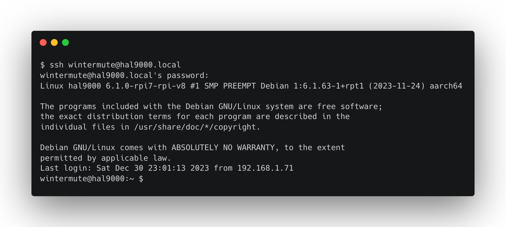
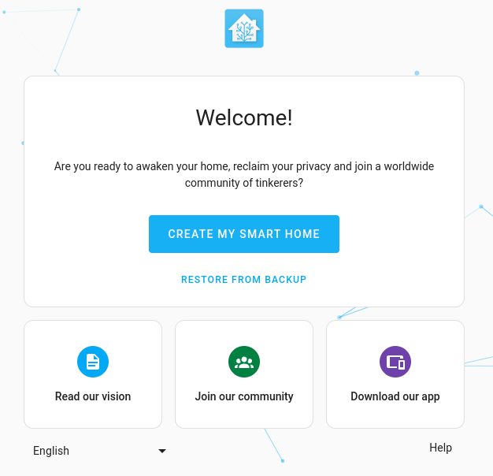
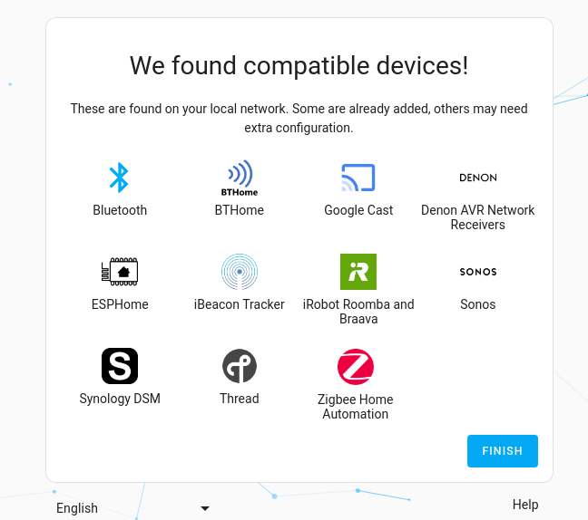

author: Tiago Santos
summary:
id: raspberry-pi-home-assistant
tags:
categories:
environments: Web
status: Published
feedback link: https://github.com/tvcsantos/codelabs/blob/master/markdown/raspberry-pi-home-assistant

# H.A.R.P. - Home Assistant Raspberry Pi

## Overview

Duration: 0:05:00


**Welcome to project HARP!**

In the days of the Internet of Things, it is common to have a lot of smart devices at home. These devices are usually
controlled by different apps, which makes it difficult to manage them. Home Assistant is an open-source home automation
platform that allows you to control all your smart devices from a single interface. It is a great tool to manage your
smart home devices, but it can also be used to automate your home.

Home Assistant also provides integration with Amazon Alexa and Google Assistant, which allows you to control your smart
home devices using voice commands. Apple HomeKit integration is also available, by using the Home Assistant Homebridge
plugin. This allows you to control your smart home devices using Siri. With all these integrations, you can unify all
your smart home devices under a single interface and control them using voice commands.

This project is a step-by-step tutorial that will teach you how to setup a Raspberry Pi with Home Assistant to control
your smart home devices. You will learn the following:

* How to setup a Raspberry Pi
    * Install Raspberry Pi OS
    * Expand Filesystem
    * Increase Swap Size
    * Install Docker
* How to setup Home Assistant
* How to install the Home Assistant Sky Connect
* How to expose Home Assistant to the Internet
    * Setup DuckDNS
    * Setup Swag

Hopefully, by the end of this tutorial, you will have a fully functional Home Assistant setup that you can use to
control your smart home devices. Enjoy!

## Prerequisites

Duration: 0:10:00

For this project, you will need the following:

* A Raspberry Pi (at least version 3)
* A microSD card (at least 32GB class 10)
* A power supply for the Raspberry Pi (please use the official Raspberry Pi power supply)
* Home Assistant Sky Connect for Zigbee (optional)

### Raspberry Pi

The Raspberry Pi is a small single-board computer that can be used for a variety of projects. It is a great tool for
learning about computers and programming. It is also a great tool for building your own smart home. The Raspberry Pi is
a very popular platform for home automation projects, because it is cheap and easy to use. It is also very easy to
connect to other devices, such as sensors and actuators.

For this project you will need at least a Raspberry Pi 3. At the time of writing this tutorial, the latest version of
the Raspberry Pi is the Raspberry Pi 5. You can follow the links below with more information about the different
Raspberry Pi models, that you can use for this project:

* <https://www.raspberrypi.com/products/raspberry-pi-3-model-b/>
* <https://www.raspberrypi.com/products/raspberry-pi-3-model-b-plus/>
* <https://www.raspberrypi.com/products/raspberry-pi-4-model-b/>
* <https://www.raspberrypi.com/products/raspberry-pi-5/>

In those links you have also information on how to buy a Raspberry Pi from the official resellers on your country.

### MicroSD card

Your Raspberry Pi needs an SD card to store all its files and the Raspberry Pi OS operating system.

For this project and taking into account future expansion, I recommend using a microSD card with at least 32GB of
storage. You can use any microSD card, but it is recommended to use a class 10 microSD card.

A good example is the SanDisk 32GB Ultra MicroSDHC C10 A1. It should look like the following:


You can find is easily on Amazon or other online stores.

### Power supply

The Raspberry Pi needs a power supply to work. You can use any power supply that provides the correct voltage and
amperage, but it is recommended to use the official Raspberry Pi power supply. You can find it also in your official
reseller or on Amazon or other online stores.

The official power supplies usually have a Raspberry Pi logo on them.


For the official power supply follow the link below:

* Raspberry Pi 3 - <https://www.raspberrypi.com/products/raspberry-pi-universal-power-supply/>
* Raspberry Pi 4 - <https://www.raspberrypi.com/products/type-c-power-supply/>
* Raspberry Pi 5 - <https://www.raspberrypi.com/products/27w-power-supply/>

### Home Assistant Sky Connect

The Home Assistant Sky Connect is a Zigbee gateway that allows you to connect Zigbee devices to Home Assistant. It is
based on the CC2531 chip and it is compatible with the Zigbee2MQTT project. It is a great tool to connect Zigbee devices
to Home Assistant, has a low price and is ease to use.

It should come in a box similar to the following:


You can find more information about the Home Assistant Sky Connect on the following link:

* <https://www.home-assistant.io/skyconnect/>

## Install Raspberry Pi OS

Duration: 0:30:00

> aside positive
> **Info:** _This step has content transcribed from the official Raspberry Pi documentation, that you can find here:
> <https://www.raspberrypi.com/documentation/computers/getting-started.html#setting-up-your-raspberry-pi>_

In order to install Home Assistant on your Raspberry Pi, you first need to install the Raspberry Pi OS operating system.
The Raspberry Pi OS is a Linux distribution based on Debian. It is the official operating system for the Raspberry Pi
and it is the recommended operating system for this project.

### Install Raspberry Pi Imager

The easiest way to install the Raspberry Pi OS is to use the Raspberry Pi Imager tool. This tool allows you to download
and install the Raspberry Pi OS on your microSD card. You can download the Raspberry Pi Imager tool from the official
Raspberry Pi website:

* <https://www.raspberrypi.com/software/>

Choose the Raspberry Pi Imager tool for your operating system. You can find versions for Windows, macOS and Ubuntu.

### Flash Raspberry Pi OS

After installing the Raspberry Pi Imager tool, you can use it to flash the Raspberry Pi OS into your microSD card. Once
you’ve installed Imager, launch the application by clicking the Raspberry Pi Imager icon or running `rpi-imager`.


Click **Choose device** and select your Raspberry Pi model from the list.

> aside negative
> **Note:** Sometimes filtering by Raspberry Pi device can be misleading. For example at the time of writing for a
> Raspberry Pi 3 Model B the Imager tool does not recommend the last Wormhole OS Lite version, which is also compatible
> with this model.


Next, click **Choose OS** and select an operating system to install. Imager always shows the recommended version of
Raspberry Pi OS for your model at the top of the list.


Connect your preferred storage device to your computer. For example, plug a microSD card in using an external or
built-in SD card reader. Then, click **Choose storage** and select your storage device.

> aside negative
> **Warning**: If you have more than one storage device connected to your computer, be sure to choose the correct
> device! You can often identify storage devices by size. If you’re unsure, disconnect other devices until you’ve
> identified the device you want to image.


Next, click **Next**.


In a popup, Imager will ask you to apply OS customisation. We will configure the Raspberry Pi via the OS customisation
settings. Click the **Edit Settings** button to open OS customisation.

#### OS customisation

The OS customisation menu lets you set up your Raspberry Pi before first boot. You can preconfigure:

* a username and password
* WiFi credentials
* the device hostname
* the time zone
* your keyboard layout
* remote connectivity

When you first open the OS customisation menu, you might see a prompt asking for permission to load WiFi credentials
from your host computer. If you respond "yes", Imager will prefill WiFi credentials from the network you’re currently
connected to. If you respond "no", you can enter WiFi credentials manually.

The **hostname** option defines the hostname your Raspberry Pi broadcasts to the network using mDNS. When you connect
your Raspberry Pi to your network, other devices on the network can communicate with your computer
using `{{hostname}}.local` or `{{hostname}}.lan`.

The **username and password** option defines the username and password of the admin user account on your Raspberry Pi.

The **wireless LAN** option allows you to enter an SSID (name) and password for your wireless network. If your network
does not broadcast an SSID publicly, you should enable the "Hidden SSID" setting. By default, Imager uses the country
you’re currently in as the "Wireless LAN country". This setting controls the WiFi broadcast frequencies used by your
Raspberry Pi. Enter credentials for the wireless LAN option if you plan to run a headless Raspberry Pi.

The **locale settings** option allows you to define the time zone and default keyboard layout for your Pi.


The **Services** tab includes settings to help you connect to your Raspberry Pi remotely.

Since we are going to use your Raspberry Pi remotely over the network, check the box next to **Enable SSH**.

* Choose the **password authentication** option to SSH into your Raspberry Pi over the network using the username and
  password you provided in the general tab of OS customisation.
* Choose **Allow public-key authentication only** to preconfigure your Raspberry Pi for passwordless public-key SSH
  authentication using a private key from the computer you’re currently using. If already have an RSA key in your SSH
  configuration, Imager uses that public key. If you don’t, you can click **Run SSH-keygen** to generate a
  public/private key pair. Imager will use the newly-generated public key.


OS customisation also includes an **Options** menu that allows you to configure the behaviour of Imager during a write.
These options allow you to play a noise when Imager finishes verifying an image, to automatically unmount storage media
after verification, and to disable telemetry.


#### Write

When you’ve finished entering OS customisation settings, click **Save** to save your customisation.

Then, click **Yes** to apply OS customisation settings when you write the image to the storage device.

Finally, respond **Yes** to the "Are you sure you want to continue?" popup to begin writing data to the storage device.


If you see an admin prompt asking for permissions to read and write to your storage medium, it’s safe to proceed.


Grab a cup of coffee or go for a walk. This could take a few minutes.


If you want to live especially dangerously, you can click **cancel verify** to skip the verification process.

When you see the "Write Successful" popup, your image has been completely written and verified. You’re now ready to boot
a Raspberry Pi from the storage device!


That's it you are now ready too boot your Raspberry Pi. Insert the microSD card into the Raspberry Pi and connect the
power supply. The Raspberry Pi should boot, wait a bit for the first boot to complete. Connect to your Raspberry Pi
using SSH in your terminal:

```console
ssh wintermute@hal9000.local
```

You should see a screen like the following



## Expand Filesystem

Duration: 0:05:00

In order to use the full capacity of your microSD card, you need to expand the filesystem. To do this, first, if you
have not done it yet, login to your Raspberry Pi using SSH.

```console
ssh wintermute@hal9000.local
```

Then run the following command:

```console
sudo raspi-config nonint do_expand_rootfs
```

This will expand your installation to fill the whole SD card, giving you more space to use for files. You will need to
reboot the Raspberry Pi to make this available. You can do this by running the following command:

```console
sudo reboot
```

## Increase Swap Size

Duration: 0:05:00

> aside positive
> **Info:** _This step has content transcribed from this tutorial: <https://pimylifeup.com/raspberry-pi-swap-file/>_

The swap file is used to increase the system’s total accessible memory beyond its hardware capabilities.

This means that when all of the Raspberry Pi’s RAM is exhausted, it can start using the swap file as memory instead.

The addition of more virtual memory allows the system to deal with more memory intensive tasks without running into out
of memory errors or having to shut down other additional packages.

However, the downside to this is that accessing the swap file is a significantly slower process that can create
slowdowns.

The reason for this is that the swap file exists on your actual disk, which has significantly lower read and write
speeds then your RAM.

Another caveat of a large swap file is that you need that space to be free on your SD Card. You can’t set a swap file on
your Raspberry Pi larger than your available free space.

With the introduction of the Raspberry Pi 4, there has been less of a need to use a swap file due to the large amounts
of RAM available. So if you’re using a Raspberry Pi 4 or newer, you may not need to increase the swap file.

> aside positive
> **Note**: Swap space should be twice the size of RAM in case the RAM amount is below **2GB**. If RAM amounts to more
> than **2GB**, then swap space should be the size of RAM + **2GB**. For example, **6GB** of swap for **4GB** of RAM.

In this section, we will be showing you the process of increasing the swap file on the Raspberry Pi.

Before beginning this section, make sure you aren’t running anything that's heavily using the memory. The reason for
this is that it could potentially already be using the swap file that we are about to change.

1. If you have not done it yet, login to your Raspberry Pi using SSH.

    ```console
    ssh wintermute@hal9000.local
    ```

2. Before we can increase our Raspberry Pi’s swap file, we must first temporarily stop it.

   The swap file cannot be in use while we increase it.
   To stop the operating system from using the current swap file, run the following command.

    ```console
    sudo dphys-swapfile swapoff
    ```

3. Next, we need to modify the swap file configuration file.

   We can open this file using nano by using the command below.

    ```console
    sudo nano /etc/dphys-swapfile
    ```

4. Within this config file, find the following line of text.

   You can use <kbd>CTRL</kbd> + <kbd>W</kbd> to search for text within the file.

    ```console
    CONF_SWAPSIZE=100
    ```

   To increase or decrease the swap file, all you need to do is modify the numerical value you find here.
   This number is the size of the swap in megabytes.

   > aside negative
   > **Warning**: Whatever size you set, you must have that space available on your SD card.

   For example, if we wanted to increase our swap size to **1GB**, we would change that line to the following.

    ```console
    CONF_SWAPSIZE=1024
    ```

5. Once you have made the change, save the file by pressing <kbd>CTRL</kbd> + <kbd>X</kbd>, followed by <kbd>Y</kbd>,
   then <kbd>ENTER</kbd>.

6. We can now re-initialize the Raspberry Pi’s swap file by running the command below.

   Running this command will delete the original swap file and recreate it to fit the newly defined size.

    ```console
    sudo dphys-swapfile setup
    ```

7. With the swap now recreated to the newly defined size, we can now turn the swap back on.

   To start the operating systems swap system, run the following command.

    ```console
    sudo dphys-swapfile swapon
    ```

   While the new swapfile is now switched on, programs will not know that this new memory exists until they restart.

8. If you want all programs to be reloaded with access to the new memory pool, then the easiest way is to restart your
   device.

   To restart your Raspberry Pi, all you need to do is run the command below.

    ```console
    sudo reboot
    ```

We hope you have successfully learned how to increase and decrease the swap file on your Raspberry Pi.

## Install Docker

Duration: 0:30:00

> aside positive
> **Info:** _This step has content transcribed from this tutorial: <https://pimylifeup.com/raspberry-pi-docker/>_

In order to install Home Assistant, we will use Docker. Docker is a tool that allows you to run applications in a
container on your Raspberry Pi. It is a great tool to run applications in a sandboxed environment, without affecting
the rest of the system. It is also a great tool to run applications that are not available for your operating system.

### Installing Docker to the Raspberry Pi

Thanks to a nifty install script developed by the Docker team, installing the container software is incredibly simple.

1. First we need to login to our Raspberry Pi using SSH, if you have not done it yet.

   ```console
   ssh wintermute@hal9000.local
   ```

2. Now first of all we need to make sure that our system is up-to-date before we proceed to install Docker.

   We can upgrade all existing packages by running the following two commands on the Raspberry Pi.
   
   ```console
   sudo apt update
   sudo apt upgrade
   ```

3. With our Raspberry Pi entirely up to date, we can now go ahead and install Docker to the Raspberry Pi.

   Luckily for us, Docker has made this process incredibly quick and straightforward by providing a bash script that installs everything for you.
   
   You can download and run the official Docker setup script by running the following command.
   
   ```console
   curl -sSL https://get.docker.com | sh
   ```
   
   This command will pipe the script directly into the command line. Typically it would be best if you didn’t do this; however, Docker is a trusted source.
   
   If you are unsure about running this directly without first inspecting it, you can go directly to get.docker.com to view the script.
   
   This script can take some time to complete as it automatically detects and installs everything it needs to run Docker on the Raspberry Pi.

### Setting up your User for Docker

We need to make a slight adjustment to our user before we can start using Docker without issues.

This is to do with the way that the Linux permission system works with Docker. By default, only the Docker user can interact with Docker but there is a way to work around this.

1. Once Docker has finished installing to your Raspberry Pi, there are a couple more things we need to do.

   For another user to be able to interact with Docker, it needs to be added to the docker group.
   
   So, our next step is to add our current user to the docker group by using the usermod command as shown below. By using “$USER” we are inserting the environment variable that stores the current users name.
   
   ```
   sudo usermod -aG docker $USER
   ```
   
   If we don’t add our user to the group, we won’t be able to interact with Docker without running as the root user.
   
   If you want to learn more about permissions and groups in Linux, check out our file permissions in Linux guide.

2. Since we made some changes to our user, we will now need to log out and log back in for it to take effect.

   You can log out by running the following command in the terminal.
   
   ```console
   logout
   ```

3. Once you have logged back in, you can verify that the docker group has been successfully added to your user by running the following command.

   ```console
   groups
   ```
   
   This command will list out all the groups that the current user is a part of. If everything worked as it should, the group docker should be listed here.

### Testing the Docker Installation on Raspberry Pi

With Docker now set up on our Raspberry Pi, we should now go ahead and test to make sure it’s working.

1. To test if Docker is working, we are going to go ahead and run the following command on our Pi.

   This command will tell Docker to download, setup and run a docker container called **hello-world**.
   
   ```console
   docker run hello-world
   ```

2. If you have successfully installed Docker to your Raspberry Pi, you should see something like this.

   

You are now safe to start using Docker for your projects. Have fun!

## Setup Home Assistant

Duration: 1:00:00

> aside positive
> **Info:** _Home Assistant configuration steps are an adapted transcript from this tutorial:
> <https://www.home-assistant.io/getting-started/onboarding/>_

Now that we have Docker installed, we can install Home Assistant. To do this, first, if you have not done it yet, login
to your Raspberry Pi using SSH.

```console
ssh wintermute@hal9000.local
```

We are going to use docker-compose to install Home Assistant. Docker Compose is a tool that allows you to define and run
multi-container Docker applications. It is a great tool to run multiple Docker containers at the same time. We will
start by moving to the home directory.

```console
cd ~
```

Then we will create a directory to store the docker compose files and move to that directory.

```console
mkdir -r docker/homeassistant
cd docker/homeassistant
```

Now we will create a file called `compose.yml`.

```console
touch compose.yml
```

And we will edit the file using nano.

```console
nano compose.yml
```

And we will add the following content to the file:

```yaml
version: '3'
services:
  homeassistant:
    container_name: homeassistant
    image: "ghcr.io/home-assistant/home-assistant:stable"
    volumes:
      - ${HOME}/homeassistant/config:/config
      - /etc/timezone:/etc/timezone:ro
      - /etc/localtime:/etc/localtime:ro
      - /run/dbus:/run/dbus:ro
    environment:
      - TZ=Europe/Lisbon
    restart: unless-stopped
    privileged: true
    network_mode: host
```

You can copy it from here and paste it in the file.

Note that you will need to change the `TZ` environment variable to your timezone. You can find a list of timezones here:

* <https://en.wikipedia.org/wiki/List_of_tz_database_time_zones>

To save the file press <kbd>CTRL</kbd> + <kbd>X</kbd>, followed by <kbd>Y</kbd>, then <kbd>ENTER</kbd>.

Now we can start Home Assistant by running the following command:

```console
docker compose up -d
```

Wait for a few minutes for Home Assistant to start. You can check the logs by running the following command:

```console
docker compose logs -f
```

Or for checking only the logs for Home Assistant container:

```console
docker compose logs -f homeassistant
```

Navigate to <http://hal9000.local:8123> and you should see the Home Assistant welcome screen.

> aside negative
> **Note**: Depending on your Raspberry Pi model, it may take a while for Home Assistant to start.



1. Select **Create my smart home**.

2. Enter a name, username, and password and select **Create account**.

   > aside negative
   > **Warning**: The username and password are used to protect access to Home Assistant. Make sure to choose a strong
   > password and store it in a password manager. There is no way to recover the owner credentials.

   

3. Enter the location of your home.

   > aside positive
   > **Info**:
   > * The location is used to populate settings such as time zone, unit system, and currency.
   > * It is also used for location-based information and automations: for example showing the weather-forecast, opening
       the shades at sunrise, or starting the vacuum when you leave the home.
   > * If you’d rather not send your location, you can choose a location far away from where you live.
   > * You can always change this information later in the settings.

   

4. Select which information you are willing to share.

   

5. Once you are done click **Next**.

   > aside positive
   > **Info**:
   > * Home Assistant will then show any devices it has discovered on your network.
   > * Don’t be alarmed if you see fewer items than shown below; you can always manually add devices later.

   

6. Finally, select **Finish** to enter the Home Assistant web interface.

   > aside positive
   > **Info**: If some of your devices were discovered and set up automatically, this default dashboard may already
   > show some of your devices.

You should now see the Home Assistant dashboard, and you are ready to start adding devices.

## Install Sky Connect (optional)

Duration: 0:30:00

> aside positive
> **Info:** _This step has content transcribed from this tutorial: <https://www.home-assistant.io/skyconnect/>_

Sky Connect is a Zigbee gateway that allows you to connect Zigbee devices to Home Assistant. It is based on the CC2531
chip and it is compatible with the Zigbee2MQTT project. It is a great tool to connect Zigbee devices to Home Assistant,
has a low price and is ease to use.

To install Sky Connect we will need to adapt the docker-compose file we created in the previous step, in order to give
the Home Assistant container access to the USB port where Sky Connect is connected. To do this, first, if you have not
done it yet, login to your Raspberry Pi using SSH.

```console
ssh wintermute@hal9000.local
```

Now navigate to the directory where you created the `compose.yml` file.

```console
cd ~/docker/homeassistant
```

And stop Home Assistant by running the following command:

```console
docker compose down
```

Now connect Sky Connect to the Raspberry Pi USB port. Give it a few seconds to be detected by the Raspberry Pi. You can
issue the following command to check if it was detected:

```console
lsusb
```

You should see an output similar to the following:


Now issue the following command to check to which `ttyUSB` port Sky Connect was connected:

```console
ls /dev/ttyUSB*
```

You should see an output similar to the following:


> aside positive
> **Info**: In this case we only have one USB device connected to the Raspberry Pi, so we only see one `ttyUSB` port.
> If you have more than one USB device connected to your Raspberry Pi, you will probably see more than one `ttyUSB`
> port. If that is the case, disconnect the Sky Connect from the Raspberry Pi and run the command again. Take note of
> the `ttyUSB` ports that remain. Then connect Sky Connect to the Raspberry Pi and run the command again. The `ttyUSB`
> port that appears is the one where Sky Connect is connected.

Now we have all the information we need to adapt the `compose.yml` file. Open the `compose.yml` file using nano for
editing.

```console
nano compose.yml
```

You will need to add a mapping for devices so that the container can access the host USB port.

```yaml
devices:
  - /dev/ttyUSB0:/dev/ttyUSB0
```

You should end up with a file similar to the following:

```yaml
version: '3'
services:
  homeassistant:
    container_name: homeassistant
    image: "ghcr.io/home-assistant/home-assistant:stable"
    volumes:
      - ${HOME}/homeassistant/config:/config
      - /etc/timezone:/etc/timezone:ro
      - /etc/localtime:/etc/localtime:ro
      - /run/dbus:/run/dbus:ro
    environment:
      - TZ=Europe/Lisbon
    devices:
      - /dev/ttyUSB0:/dev/ttyUSB0
    restart: unless-stopped
    privileged: true
    network_mode: host
```

To save the file press <kbd>CTRL</kbd> + <kbd>X</kbd>, followed by <kbd>Y</kbd>, then <kbd>ENTER</kbd>.

Now we can start Home Assistant by running the following command:

```console
docker compose up -d
```

Wait for a few minutes for Home Assistant to start and navigate to <http://hal9000.local:8123>. Enter your credentials
to enter the Home Assistant dashboard.

On the left menu, click on **Configuration** and then on **Devices & Services**. By now you should see the Sky Connect
device listed, as it was automatically detected by Home Assistant.


Select **Configure**. You should see the following screen:


Select **Submit**. You should see the following screen:


Select **Create Network**. Once the network has been set up you should see the following screen:


Add the Zigbee Coordinator to an area and Select **Finish**. Your Zigbee devices are now added to your Zigbee network.

Now you can add your Zigbee devices to Home Assistant. To do this, on **Configuration > Devices & Services** look for
**Zigbee Home Automation**. You should see the following screen:


> aside negative
> **Note**: You will need to put your Zigbee device in pairing mode. Please refer to the device manual for instructions on how to
> do this. If ZHA can't find your Zigbee device make sure that SkyConnect does not suffer from interference. Use the
> extension cable and try placing the SkyConnect further away from potential devices which can cause interference.

Click on **1 device** and select **Add devices** via this device. ZHA will now search for Zigbee devices in pairing
mode. When detected follow the configurations steps and you should be ready to go!

## Expose Home Assistant to the Internet (optional)

Duration: 1:00:00

If you want to control your smart home devices from outside your home network, you will need to expose Home Assistant to
the Internet. Also, some integrations require Home Assistant to be exposed to the Internet.

To expose Home Assistant to the Internet, we will use the DuckDNS and SWAG. DuckDNS is a free service that allows you to
create a subdomain and associate it with your public IP address. SWAG sets up a Nginx webserver and reverse proxy with
php support and a built-in certbot client that automates free SSL server certificate generation and renewal processes
(Let's Encrypt and ZeroSSL). SWAG also contains fail2ban for intrusion prevention.

With these two tools, we will be able to expose Home Assistant to the Internet using a secure connection.

### Setup DuckDNS

First, we need to create a DuckDNS account. You can do this by going to the following link:

* <https://www.duckdns.org/>

You should see a screen similar to the following:


Create an account, or login if we already have one. After that, something like this should appear:


Copy the token and save it, you will need it later.

Create a domain name. You can use any name you want, but it is recommended to use a name that is easy to remember. In
this example, we will use `my-domain`.

After this we need to keep DuckDNS in sync with our public IP address, so that when we access our domain name, we are
redirected to our public IP address. To do this, we will use DuckDNS integration provided by Home Assistant.

As first step login to your Raspberry Pi using SSH.

```console
ssh wintermute@hal9000.local
```

Now enter the Home Assistant container by running the following command:

```console
docker exec -it homeassistant bash
```

You will land in the Home Assistant container shell inside the `/config` directory. Now we need to edit the
`configuration.yaml` file. To do this, run the following command:

```console
vi configuration.yaml
```

At the end of the file add the following lines:

```yaml
duckdns:
  domain: {{your duckdns domain}}
  access_token: {{your duckdns token}}
```

Replace `{{your duckdns domain}}` with the domain name you created in the previous step and `{{your duckdns token}}`
with the token you copied in the previous step.

So as an example, if your domain name is `my-domain` and your token is `12345678-1234-1234-1234-123456789012`, you
should end up with something like this:

```yaml
duckdns:
  domain: my-domain
  access_token: 12345678-1234-1234-1234-123456789012
```

Now save the file by pressing <kbd>ESC</kbd>, followed by <kbd>:</kbd>, then <kbd>w</kbd>, then <kbd>q</kbd>,
then <kbd>ENTER</kbd>.

Exit the Home Assistant container by running the following command:

```console
exit
```

Now restart Home Assistant by running the following commands:

```console
docker compose down
docker compose up -d
```

You should now have DuckDNS integration working.

### Setup Swag

Now that we have DuckDNS integration working, we can setup Swag. As first step login to your Raspberry Pi using SSH.

```console
ssh wintermute@hal9000.local
```

Now navigate to the directory where you created the `compose.yml` file.

```console
cd ~/docker/homeassistant
```

And stop Home Assistant by running the following command:

```console
docker compose down
```

Wait for it to stop and then edit the `compose.yml` file using nano.

```console
nano compose.yml
```

Add the following lines to the `compose.yml` file:

```yaml
  swag:
   container_name: swag
   image: linuxserver/swag
   restart: unless-stopped
   cap_add:
      - NET_ADMIN
   volumes:
      - ${HOME}/swag/config:/config
      - /etc/timezone:/etc/timezone:ro
      - /etc/localtime:/etc/localtime:ro
   environment:
      - PGID=1000
      - PUID=1000
      - EMAIL={{your email}}
      - URL={{your duckdns domain}}.duckdns.org
      - SUBDOMAINS=wildcard
      - VALIDATION=duckdns
      - TZ=Europe/Lisbon
      - DUCKDNSTOKEN={{your duckdns token}}
   ports:
      - 180:80
      - 1443:443

# set trusted docker internal network
networks:
  default:
     ipam:
        config:
           - subnet: 172.10.0.0/24
```

Replace `{{your email}}` with your email address that you used to create the DuckDNS account, `{{your duckdns domain}}`
with the domain name you created in the previous step and `{{your duckdns token}}` with the token you copied in the
previous step.

After that save the file by pressing <kbd>CTRL</kbd> + <kbd>X</kbd>, followed by <kbd>Y</kbd>, then <kbd>ENTER</kbd>.

Now start Home Assistant by running the following command:

```console
docker compose up -d
```

If all goes well you should now have SWAG running. You can check the logs by running the following command:

```console
docker compose logs -f swag
```

You should see something like this, stating that all went well:

```text
swag | [services.d] starting services
swag | [services.d] done.
swag | Server ready.
```

Now we need to configure SWAG Nginx server. First check the IP address of your Raspberry Pi by running the following

```console
ip a | grep -E 'wlan0|eth0'
```

You should see something like this:


Note that we have two IP addresses, one for the `eth0` interface corresponding to the Ethernet port and one for the
`wlan0` interface corresponding to the WiFi port. Always prefer the `eth0` interface, as it is more stable.

In this case the IP address is `192.168.1.142`, save this information, you will need it later.

Now enter the SWAG container by running the following command:

```console
docker exec -it swag bash
```

You will land in the SWAG container shell inside the root `/` directory. Navigate to `/config/nginx/proxy-confs`
directory by running the following command:

```console
cd /config/nginx/proxy-confs
``` 

There you will find a file called `homeassistant.subdomain.conf.sample`. Copy it to a new file called
`homeassistant.subdomain.conf` by running the following command:

```console
cp homeassistant.subdomain.conf.sample homeassistant.subdomain.conf
```

Normally, in docker-compose, SWAG/NGINX would know the IP address of home assistant But since it uses ‘net mode’ we need
to tell it the IP address of home assistant. To do this issue the following command:

```console
sed -i 's/set $upstream_app homeassistant;/set $upstream_app 192.168.1.142;/' homeassistant.subdomain.conf
```

Don't forget to replace `192.168.1.142` with the IP address of your Raspberry Pi that you got earlier.

Exit the SWAG container by running the following command:

```console
exit
```

Now enter the Home Assistant container by running the following command:

```console
docker exec -it homeassistant bash
```

You will land in the Home Assistant container shell inside the `/config` directory. Now we need to edit the
`configuration.yaml` file. To do this, run the following command:

```console
vi configuration.yaml
```

Before `duckdns` configuration add the following lines:

```yaml
http:
  ip_ban_enabled: true
  login_attempts_threshold: 3
  use_x_forwarded_for: true
  trusted_proxies:
    - 192.168.1.0/24  # Local Lan
    - 172.10.0.0/24  # Docker network
```

Note that you will need to replace `192.168.1.0` with the equivalent IP address of your local network. If your local
network is `192.168.XXX.YYY` you will need to replace it with `192.168.XXX.0`.

Save the file by pressing <kbd>ESC</kbd>, followed by <kbd>:</kbd>, then <kbd>w</kbd>, then <kbd>q</kbd>,
then <kbd>ENTER</kbd>.

Exit the Home Assistant container by running the following command:

```console
exit
```

Now restart all containers by running the following commands:

```console
docker compose down
docker compose up -d
```

Wait for a few minutes for everything to start. You are now ready from the Home Assistant side. The last thing missing
is to configure your router to forward the ports `80` and `443` to your Raspberry Pi IP address. Please refer to your
router manual on how to do this.

After this, you should be able to access Home Assistant from the Internet. To do this, navigate to
<https://homeassistant.my-domain.duckdns.org>. You should see the Home Assistant login screen.

Note that you will need to replace `my-domain` with the domain name you created on DuckDNS.
